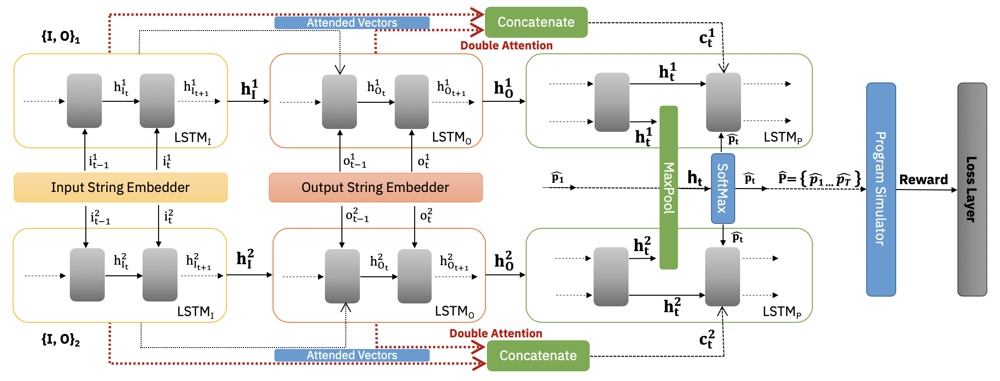

# Optimising Program Generalisability in Statistical Models with Reinforcement Learning

## Abstract
Recent years have seen the development of statistical approaches employing sequence-to-sequence neural models for Programming-by-example (PbE) systems that capture user intent expressed through input-output examples adhering to pre-defined specifications. Although these approaches require less domain-specific knowledge and no hand-engineered rules, they are plagued with three main issues - (i) Program Aliasing - multiple semantically correct programs which are penalized during training against reference ground-truth programs (ii) Objective Mismatch - training the model performance is evaluated against the reference ground-truth program while during inference, the transformed output string is evaluated for correctness, and (iii) Exposure Bias - during training, the input to the decoder network is from ground-truth tokens while during the inference stage, it is from the learned model distribution. To address these issues, we propose to utilize policy gradients in a Reinforcement Learning (RL) framework, which is initialized through cross-entropy loss to ensure the model starts with meaningful policy instead of a random one. We discuss problem formulation the RL network architecture and show significant improvements on generalisability for both unseen function sequences and for unseen arguments in string manipulation tasks.

## Table of content
Following is the help guide to use the Reinforcement Learning framework to improve Deep Learning based statistical models for program generation.

- [Dataset](#dataset)
    - [Synthetic Dataset](#synthetic-dataset)
    - [Flashfill Dataset](#flashfill-dataset)
- [Model Training](#model-training)
- [Evaluation](#evaluation)
- [Links](#links)

## Dataset

[SyntheticD]: (Will add)
[RealD]: (Will add)

### Synthetic Dataset

Stored at [SyntheticD]: It contains synthetically generated datasets to train PbE systems for string transformation. The dataset is generated as per the procedure described in the paper i.e. for each transformation program, we sample 10 input-output example pairs where `m` number are used for generating the transformation program and `10-m` are used to evaluate the program. Here is the folder hierarchy and its interpretation:-

* `train_500k.json`: Contains 500k samples (program, input examples and corresponding outputs) for model training.
* `val_50k.json`: Contains 50k samples for model evaluation.
* `Val_50k_curate`: Contains splits of `val_50k.json` where we capture the overlap in the transformation program seen by the model during training:
  * `onlyFunctionNames`: Overlap/Partial/nonoverlap splits of `val_50k.json` where we match only the function names of the transformation programs with those from `train_500k.json`.
  * `nonModified`: Overlap/Partial/nonoverlap splits of `val_50k.json` where we match the function names and their arguments of the transformation programs with those from `train_500k.json`.
  * `Modified`: Ignore
* `Test_Curated`: A subset of Val_50k_curated which contains three splits only where we want to evaluate the model based on the following criterion: 
  * transformation programs seen by the model during training: `nonModified_overlap.json`
  * function sequence seen but arguments unseen: `onlyFunctionNames_overlap.json`
  * function sequences unseen: `onlyFunctionNames_nonOverlap.json`
  
### Flashfill Dataset
  
Stored at [RealD]: The flash-fill dataset contains 335 real-life string manipulation tasks containing both logical and non-logical tasks. We shortlist 142 non-logical tasks and specify it in the file `no_logic_tasks.json`, which contains name and ID of each selected task. Additionally, we separately store 77 non-logical tasks which have at least 10 input-output example pairs in the file `no_logic_tasks_10_samples_each.json`. Here is the folder hierarchy and its interpretation: -

* `FlashFill_orig_CSV`: Folder containing CSV files for each flash-fill task, where each file has input-output example pairs
* `FlashFill_orig_JSON`: Folder containing JSON files in which every flash-fill task, its input samples and output samples are stored for ready-to-use.
  * `flashFill_raw_no_empty_op.json`: Tasks do not contain input-output example pairs where the output is an empty string.
  * `flashFill_raw_with_empty_op.json`: Tasks contain input-output example pairs where the expected output is an empty string.
* `FlashFill_Curated_CSV`: Folder containing CSV file for each flash-fill task specified in `no_logic_tasks.json`.
* `FlashFill_Curated_JSON`: Folder containing JSON files in which only non-logical tasks, input samples and output samples are stored for ready-to-use.
  * `flashFill_raw_no_empty_op.json`: Contains non-logical tasks, and each task is without input-output example pairs where the output is an empty string. 
  * `flashFill_10_samples_per_task.json`: Also contains non-logical tasks, but each task now has a fixed number of input-output example pairs. The task list is specified in `no_logic_tasks_10_samples_each.json`

## Model Training

Here, we provide instructions to train the model using both XE Loss and RE Loss.

<details><summary><b>Cross Entropy Loss (XE)</b></summary>
  
1. Install the dependencies.

    ```sh
    $ pip install -r requirements.txt
    ```
    
2. Download the training-validation dataset from [here](Will add) into the `/data` folder and indicate their relative path in the config file (See [Config](#config)).

 ```json
   {
     "train_data_path": "./data/train_500k.json ",
     "validation_data_path": "./data/val_50k.json",
   }
 ```

3. Indicate the model parameters in your configuration file `neural_architecture.jsonnet` (See [config.json](Will add)).

</details>

<details><summary><b>Reinforce Loss (RL)</b></summary>
  
1. Train the model with XE Loss for few epochs.

  ```json
    {
      "training_signal": "supervised"
    }
  ```

2. Monitor the custom metrics and extract the trained weights for model with the best generalization accuracy. (Let's call it `best.th`)

3. Paste the model under the alias `best.th` in the root directory (`./`) containing model code.

4. Indicate the `training_signal` as `rl` and train the model with Reinforce Loss for few epochs (See [config.json](Will add)).
 ```json
    {
      "training_signal": "rl"
    }
  ```

</details>

And now here’s how you train the model using AllenNLP ():

```sh
 $ allennlp train root_dir/neural_architecture.jsonnet -s root_dir/checkpoint --include-package root_dir/model
```
**Instructions**: There should be no pre-existing `checkpoint` folder directory present at `root_dir/checkpoint`. In case you want to resume model training from the previously saved checkpoint in your serialisation directory, use `-r` flag in the command.

**Tips**: RL-based training is memory consuming, since it stores `batch_size*nb_rollouts*max_decoding_steps` number of gradients before back-propagation. Decreasing the `nb_rollouts` too much is not recommended because a higher value (64-100) is required for stable RL training. Also, `max_decoding_steps` should roughly match the avg. program length (i.e. num of functions + their arguments) we allow the model to decode. Thus, only parameter we can play with is `batch_size`. 

Therefore, by default, we perform gradient accumulation for `rl` and `beam-rl` training (`accumulate_gradients` in `custom_trainer.py` is set to `True`). The idea is, instead of doing the forward pass for complete batch at once, you do it in steps, accumulate the gradients for each step and then back-propagate. The parameter that we can play with is `rl_inner_batch` which indicates inner batch size and it should perfectly divide batch_size. Note that `rl_inner_batch` balances the trade-off between time-consumed and memory-consumed. If it is high, time-consumed for training will decrease, but memory consumption will increase and vice-versa when it is too low.

During testing, this is not the case. We use Beam-search to decode top-k programs, where k is set to 100 (See parameter `val_beam_size` in `program_decoder_rl.py`)  and we allow for maximum of 50 decoding steps (See parameter val_max_steps in `program_decoder_rl.py`). Max_decoding_steps during train and test time need not be the same. For later, I have manually set it to the aforementioned values in program_decoder_rl.py.

## Config

In the config file, you can tune the following parameters:
* **lazy**: with `false`, the model will pre-load the whole dataset into memory. Use `true` to conserve memory while data loading.
* **training_signal**: Method for training the model. It could be `supervised` for XE Loss, `rl` for Reinforce training.
* **rl_environment**: Environment to generate rewards. It could be `BlackBoxConsistency` to generate positive reward when the program is correct on observed example-pairs and `BlackBoxGeneralization` if program is correct on held-out example pairs.
* **nb_rollouts**: Number of programs to decode per set of observed example pairs. Keep it in between 50 and 100.
* **validation_metric**: Metric to monitor while validating the model. Choose between `+acc_consistency`, `+acc_generalisation`, `-loss`.
* **rl_inner_batch**: Size of inner batch size for gradient accumulation. Note that `batch_size` should be divisible by `rl_inner_batch`. This parameter will only be used for rl-based training.
* **max_decoding_steps**: Indicates for how many maximum number of time-steps, we are allowing decoding of program.
* **cuda_device**: To choose between CPU/GPU. For CPU, use -1 and for GPU, use 0. Mulit-GPU training currently not supported.

* Optimisation-based parameters (Do not set shuffle to `true`. Model is sensitive to order of training samples, they appear in):

   ```json
      "trainer": {
         "shuffle": false,
         "optimizer": {
           "type": "adam",
           "lr": 0.001
     },
     "learning_rate_scheduler":{
         "type": "step",
         "step_size": 4,
         "gamma": 0.5
     },
     "patience": 2, 
     "num_epochs": 2
   ```

## Evaluation

How it works? In each forward pass of the decoder:

* Collect observed example pairs and held-out example pairs per sample
* For each set of observed example pairs:
  * Use Beam Search to decode top-k transformation programs
    * For each predicted program:
      * Decode the program into its executable form
      * Match the predicted program with GT program (only if later is provided)
      * Parse the predicted program to verify its syntax
      * If syntactically correct, run the predicted program on observed example pairs to check its consistency
      * If consistent, run the predicted program on held-out example pairs to check generalization
* Return the computed metrics for the batch

<p align="center">
  
</p>

We have provided some trained-models that can be used right out of the box.

 | Loss | m | Environment |
 | --- | ---  | --- |
 | [XE](Will add) | 1  | NA |
 | [XE](Will add) | 4  | NA |
 | [RL](Will add) | 1  | Generalisation |
 | [RL](Will add) | 4  | Consistency |
 | [RL](Will add) | 4  | Generalisation |

<details><summary><b>Show instructions</b></summary>
 
1. Download the best performing model ([RL](Will add)).

2. Declare the following paths in `evaluate.py` to load the downloaded trained model.

  ```code
   serialization_dir = "path_to_model_dir"
   params_file = "path_to_model_dir/config.json"
  ```

3. To generate the top-k programs with their ranks and scores, run `display_prog()` with `file_path` pointing to json file containing only **one** test sample. Note that the sample should have minimum `m` number of input-output string pairs. For example (see below test sample), [RL](Will add) will use `m = 4` examples to generate the transformation program and `total_pairs-m = 1` will be used to evaluate it.

```json
{
    "input": [
        "2001..11..6",
        "1846..1..31",
        "1712..11..2",
        "2160..8..2",
        "2072..9..26",
    ],
    "output": [
        "2001",
        "1846",
        "1712",
        "2160",
        "2072",
    ]
}
```

Run the following command on above test sample (if present in `sample_test.json`):-
```sh
 $ display_prog(file_path='./data/sample_test.json')
```

4. To evaluate the model on synthetic test dataset, declare the path i.e. `evaluation_data_path` and run `evaluate_model_and_save()`.

5. To evaluate the model on flash-fill benchmark, declare the path i.e. `flash_fill_eval_path` to json containing  flash-fill tasks, declare the path to `flash_fill_save_path` to save the results in json format and run `evaluate_model_on_flash_fill()`.

</details>

## Links
